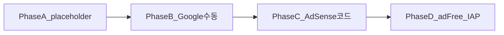

# StoryEcho 광고 운영 가이드

AdSense 승인 전·후, 코드 연동, 수동 작업 체크리스트를 한곳에 정리합니다.

## 목표·스택

| 구분           | 선택                           | 비고                                                                                                                                                 |
| -------------- | ------------------------------ | ---------------------------------------------------------------------------------------------------------------------------------------------------- |
| 웹(PWA)        | **Google AdSense** (하단 배너) | `ca-pub-...` + `data-ad-slot`, API 키 형태 아님                                                                                                      |
| 모바일 앱      | **Expo WebView** → 동일 웹 URL | [`apps/mobile/components/StoryEchoWebView.tsx`](../apps/mobile/components/StoryEchoWebView.tsx) — 별도 AdMob 없이도 웹 광고가 앱 하단에 보일 수 있음 |
| 네이티브 AdMob | 후순위                         | WebView 단독 배포 시 웹 AdSense만으로 충분한 경우가 많음                                                                                             |

## 코드 지도

```
app/(shell)/layout.tsx
  └── AppShell
        ├── AppHeader
        ├── children (탭 5화면)
        ├── AdBanner          ← placeholder / 승인 후 AdSense
        └── BottomTabBar
```

| 파일                                                                                                                                                            | 역할                                      |
| --------------------------------------------------------------------------------------------------------------------------------------------------------------- | ----------------------------------------- |
| [`apps/web/components/app-shell/ad-banner.tsx`](../apps/web/components/app-shell/ad-banner.tsx)                                                                 | 하단 띠 (탭바 **위**, `z-40`)             |
| [`apps/web/components/app-shell/app-shell.tsx`](../apps/web/components/app-shell/app-shell.tsx)                                                                 | `AdBanner` + 본문 하단 패딩               |
| [`apps/web/components/app-shell/bottom-tab-bar.tsx`](../apps/web/components/app-shell/bottom-tab-bar.tsx)                                                       | 탭바 (`z-50`, `bottom-0`)                 |
| [`apps/web/app/globals.css`](../apps/web/app/globals.css)                                                                                                       | `--shell-tab-height`, `--ad-strip-height` |
| [`apps/web/app/app/(shell)/settings/_components/settings-ad-removal-card.tsx`](<../apps/web/app/app/(shell)/settings/_components/settings-ad-removal-card.tsx>) | 광고 제거 CTA (IAP TODO)                  |
| [`packages/database/prisma/schema.prisma`](../packages/database/prisma/schema.prisma)                                                                           | `User.adFree`                             |

**노출 범위**: `(shell)` 레이아웃만 — detail·write·랜딩에는 배너 없음.

## 레이아웃 규칙

CSS 변수 (`:root`):

- `--shell-tab-height`: `4rem` (64px)
- `--ad-strip-height`: `3.125rem` (50px) — [`.md/DESIGN.md`](../.md/DESIGN.md) 기준

스택 (아래 → 위):

1. `BottomTabBar` — `fixed bottom-0`, `z-50`
2. `AdBanner` — `fixed bottom-[var(--shell-tab-height)]`, `z-40`
3. 스크롤 콘텐츠 / FAB

패딩 공식:

- **AppShell 본문**: `tab + ad + safe-area`
- **스크롤 영역 (FAB 있는 탭)**: `tab + ad + 2rem + safe-area`
- **FAB**: `tab + ad + 1rem + safe-area`

`adFree` 연동 후에는 배너를 숨기고, 위 calc에서 `--ad-strip-height` 항을 빼는 처리가 필요합니다 (아직 미구현).

## 타임라인



---

## Phase A — 지금 (placeholder)

**상태**: AdSense 스크립트 없음. 하단 50px 띠만 예약.

### 로컬 확인

```bash
pnpm --filter web dev
```

| 경로                                                 | 확인                       |
| ---------------------------------------------------- | -------------------------- |
| `/app`                                               | 띠가 탭 위, 콘텐츠 안 가림 |
| `/app/drawer`, `/community`, `/capsule`, `/settings` | 동일 + FAB 위치            |
| `/app/drawer/[id]` 등 detail                         | **띠 없음**                |

### 프로덕션

- placeholder만 배포해도 됨 (수익 없음, 레이아웃·심사용 URL 확보)
- 실제 광고·수익은 Phase B·C 이후

---

## Phase B — 수동 (Google·배포) — 체크리스트

아래는 **코드 밖**에서 직접 진행합니다.

### 1. Google AdSense

- [ ] [Google AdSense](https://www.google.com/adsense/) 가입
- [ ] **사이트 추가** — 프로덕션 도메인만 (예: `https://your-domain.vercel.app`)
- [ ] 사이트 소유 확인 (HTML 메타 태그 또는 `ads.txt` — 콘솔 안내 따름)
- [ ] **ads.txt** — AdSense가 제공하는 한 줄을 사이트 루트에 배포
  - Next.js: `apps/web/public/ads.txt` 추가 후 재배포
- [ ] 정책 페이지 URL 준비 (개인정보처리방침·이용약관 — 실제 접근 가능한 URL)
- [ ] 콘텐츠·트래픽·정책 심사 요청
- [ ] 승인 대기 (수일~수주)
- [ ] 거절 시: 사유 확인 → 콘텐츠·정책·네비게이션 보완 후 재신청

### 2. 배포·도메인

- [ ] Vercel(또는 호스트)에 **프로덕션 URL** 고정
- [ ] `NEXT_PUBLIC_APP_URL` 등 앱 URL env가 프로덕션과 일치
- [ ] 모바일 `EXPO_PUBLIC_WEB_URL`이 동일 프로덕션 `/app`을 가리키는지 확인

### 3. 심사 전 주의

- 로컬 `localhost`만으로는 **실광고·승인 검증 불가**
- placeholder 배포 URL로 “사이트가 살아 있음”을 보여주는 것은 가능
- AdSense **승인 전**에는 `adsbygoogle.js`를 프로덕션에 넣지 않는 것을 권장 (현재 코드도 미삽입)

---

## Phase C — 승인 후 (코드 교체)

### 1. AdSense 콘솔에서 발급

- [ ] **게시자 ID**: `ca-pub-XXXXXXXXXXXXXXXX`
- [ ] **광고 단위** 생성 → **디스플레이 배너** (가로형 하단 띠에 맞는 형식)
- [ ] **슬롯 ID**: `data-ad-slot="1234567890"`

### 2. 환경 변수

`apps/web/.env.local` (로컬) / Vercel Environment Variables (프로덕션):

```env
# AdSense (승인 후에만 설정)
NEXT_PUBLIC_ADSENSE_CLIENT=ca-pub-XXXXXXXXXXXXXXXX
NEXT_PUBLIC_ADSENSE_SLOT=1234567890
```

예시 파일: [`apps/web/.env.local.example`](../apps/web/.env.local.example)

### 3. `AdBanner` 구현 방향

1. `"use client"` 컴포넌트로 전환
2. `next/script`로 로드:
   - `https://pagead2.googlesyndication.com/pagead/js/adsbygoogle.js?client=ca-pub-...`
   - `strategy="afterInteractive"`
3. 마크업 예시:

```tsx
<ins
  className="adsbygoogle"
  style={{ display: "block" }}
  data-ad-client={process.env.NEXT_PUBLIC_ADSENSE_CLIENT}
  data-ad-slot={process.env.NEXT_PUBLIC_ADSENSE_SLOT}
  data-ad-format="horizontal"
  data-full-width-responsive="true"
/>
```

4. 마운트 후: `(window.adsbygoogle = window.adsbygoogle || []).push({})`
5. env 미설정 시 → **현재 placeholder** 유지 (승인 전·스테이징)

### 4. 스테이징·테스트

- [ ] 스테이징 URL에서 `data-adtest="on"` 으로 레이아웃·요청만 검증 (수익 없음)
- [ ] 프로덕션에서 실광고 노출·AdSense 대시보드 노출 수 확인
- [ ] CSP / `Content-Security-Policy`에 `googlesyndication.com`, `googleads.g.doubleclick.net` 허용 여부 점검

### 5. WebView

- [ ] 실기기 Expo 앱에서 `/app` 하단에 배너 노출
- [ ] safe-area와 겹침 없는지 확인 (이미 `--safe-area-bottom` 사용)

---

## Phase D — 수익·UX 후속

### 광고 제거 (`User.adFree`)

- [ ] `GET /api/v1/users/me` 응답에 `adFree` 노출 (이미 DB 필드 존재 시 mapper 확인)
- [ ] `AppShell`: `adFree === true` → `AdBanner` 미렌더 + 패딩에서 `--ad-strip-height` 제거
- [ ] 게스트는 항상 광고 (또는 기획에 맞게 정의)

### IAP (₩4,900 / F19)

- [ ] 스토어 상품 등록 (Apple / Google)
- [ ] 결제 검증 API·웹훅
- [ ] 성공 시 `users.ad_free = true`
- [ ] [`settings-ad-removal-card.tsx`](<../apps/web/app/app/(shell)/settings/_components/settings-ad-removal-card.tsx>) toast TODO 제거

기획 참고: [`.md/기획.md`](../.md/기획.md) F18·F19

---

## 검증 체크리스트 (통합)

### Placeholder (Phase A)

- [ ] 탭 5화면 하단 띠 + 탭바 겹침 없음
- [ ] 서랍/커뮤니티/캡슐 FAB가 띠·탭 위에 위치
- [ ] detail/write에 띠 없음

### AdSense (Phase C)

- [ ] 프로덕션에서 실광고 로드
- [ ] AdSense 대시보드 노출·클릭 집계
- [ ] `ads.txt` 200 응답 (`https://도메인/ads.txt`)
- [ ] WebView 앱에서 동일

### adFree (Phase D)

- [ ] 구매 후 배너·여백 제거
- [ ] 재로그인·다른 기기에서도 유지

---

## FAQ

**Q. 로컬에서 AdSense 테스트?**  
A. `data-adtest="on"`은 **배포 URL**에서만 의미 있습니다. 로컬은 placeholder로 레이아웃만 확인하세요.

**Q. WebView만 쓰는데 AdMob도 필요?**  
A. 필수 아님. 웹 AdSense가 WebView 안에 그대로 렌더됩니다. 스토어 정책·수익 최적화는 별도 검토.

**Q. placeholder를 프로덕션에 올려도 되나?**  
A. 가능합니다. 수익은 없고, 하단 UX·심사용 URL 확보에 도움이 됩니다.

**Q. 광고 높이가 50px이 아니게 되면?**  
A. `--ad-strip-height`와 `AdBanner` `h-[var(--ad-strip-height)]`만 조정하면 shell/FAB calc가 함께 맞춰집니다.

---

## 관련 문서

- [`.md/DESIGN.md`](../.md/DESIGN.md) — 탭 64px + 광고 50px
- [`.md/기획.md`](../.md/기획.md) — F18 배너, F19 광고 제거 IAP
- [README.md](../README.md) — 실행·env 설정
